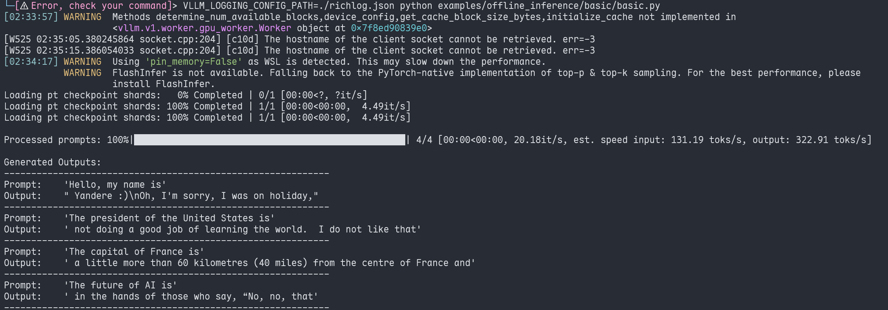

# my-gists

[toc]  

#### vllm use rich as extern logger
refs: 
+ [Logging Configuration](https://docs.vllm.ai/en/latest/getting_started/examples/other/logging_configuration.html#vllm_logging_config_path)
+ [Logging Handler](https://rich.readthedocs.io/en/latest/logging.html)
[vllm_logging_use_rich](./vllm_logging_use_rich.json)
usage:
```bash
VLLM_LOGGING_CONFIG_PATH=./richlog.json python examples/offline_inference/basic/basic.py
```
output:
